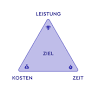
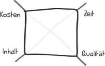

# Stakeholderanalyse
Die Stakeholderanalyse gehört zu den wichtigsten Methoden im Projektmanagement
 und hat das Ziel, folgende Fragen zu klären:
- Welche Personen(-gruppen), Interessengemeinschaften oder Organisationen sind mögliche Stakeholder?
- Welchen Einfluss haben die einzelnen Stakeholder auf das Projekt?

# Umfeld analyse
Eine Umfeldanalyse bezeichnet das Sammeln, Ordnen und Visualisieren der Einflussfaktoren eines Projekts
 bzw. eines Unternehmens. 

- political
- economical
- social
- technological
- legal
- envirommental

Durch die Umfeldanalyse lassen sich schnell die wichtigsten

**Personengruppen und Rahmenbedingungen** erkennen,
 
die eine Auswirkung auf ein spezifisches Projekt haben.

# Magisches Dreieck
Das magische Dreieck ist ein **Konzept aus dem Projektmanagement**.

Hierbei geht es darum, die drei Dimensionen 

- Zeit,
- Umfang (Leistung)
- Kosten 

in ein Gleichgewicht zu bringen.

Dazu ist wichtig, in welchem Zusammenhang diese zueinander stehen und wie sich das magische Dreieck

an die Ziele und den Führungsstil anpassen lässt.

# Teufelsquadrat

Das Teufelsquadrat ist eine Erweiterung des magischen Dreiecks

und damit ein einfaches Hilfsmittel, um die **wichtigsten Zielgrößen** im Projekt zu visualisieren.

Als Erweiterung des Maischen Dreiecks könnten folgende Zielgrößen dargestellt werden
- Zeit
- Umfang
- Kosten
- Qualität (ISO 9126?)

Treten Änderungen auf, können diese auch während der Projektlaufzeit gut

durch die „Verformung“ des Quadrats dargestellt werden.

